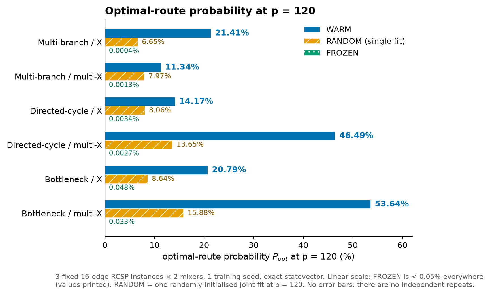
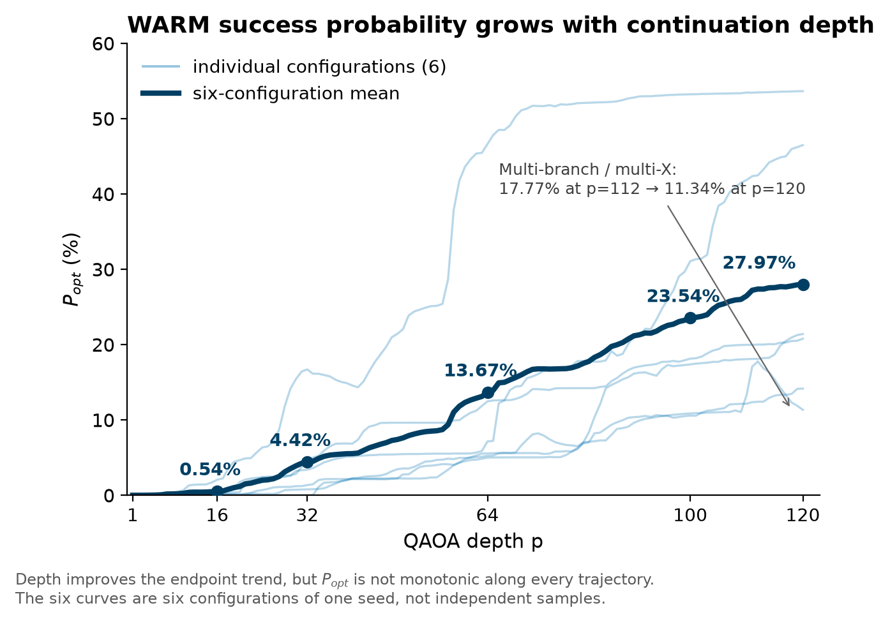
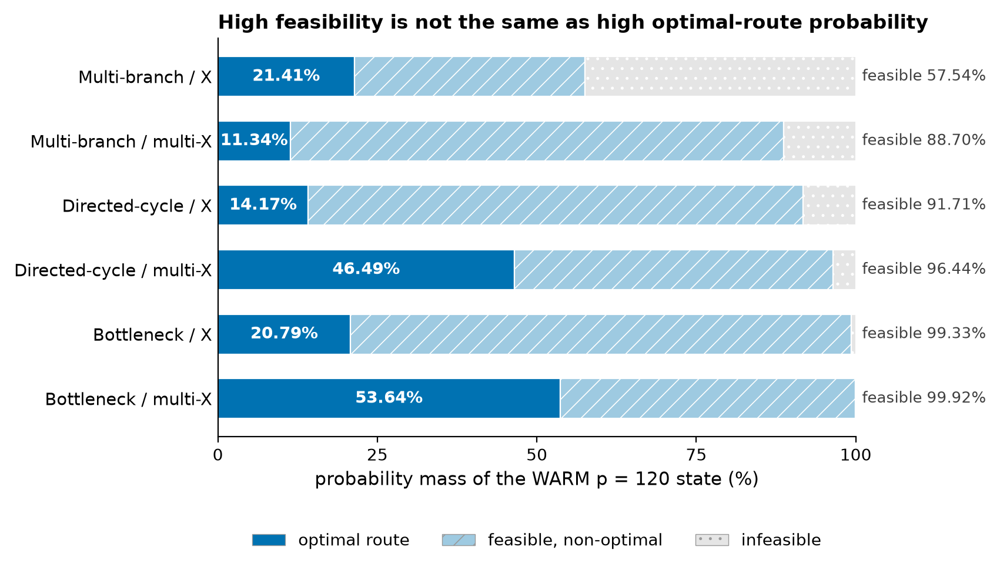
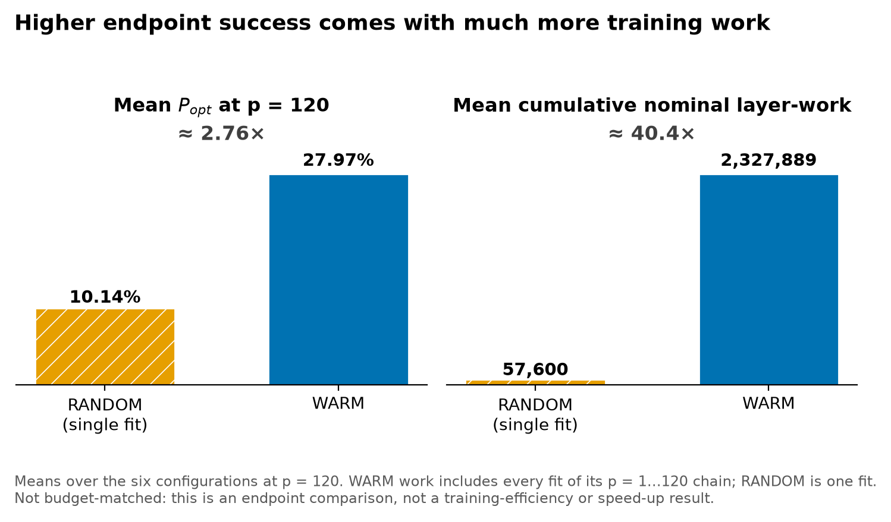
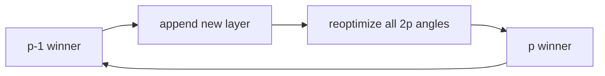

# Depth Continuation with Full-Parameter Reoptimization for Full-Space QAOA on RCSP

*A reproducible study of how depth continuation and joint reoptimization change optimal-route sampling in full-space QAOA.*

[](https://github.com/ZhilinChen02/Depth-Continuation-RCSP-QAOA/actions/workflows/tests.yml)

[](LICENSE)
[](DATA_LICENSE.md)

We train exact full-space QAOA on a resource-constrained shortest-path (RCSP) problem up to depth p = 120 and compare three training protocols. **WARM** inherits the depth-(p−1) solution and re-optimizes all 2p angles. **FROZEN** trains only the new layer. **RANDOM** is a single randomly initialised joint fit at the target depth.

## Key result

| p = 120, WARM | Result |
|---|---:|
| Mean optimal-route probability | **27.97%** |
| Range across six configurations | **11.34–53.64%** |
| vs tested FROZEN / single RANDOM | **6 / 6 higher** |
| Cumulative nominal work vs RANDOM | **40.4×** |

> **Interpretation.** WARM achieved higher final P_opt on all six tested RCSP configurations, but it also consumed much more cumulative training work. The study does not establish a budget-matched efficiency advantage.



- **WARM leads everywhere.** It is ahead of both other protocols in every configuration of 3 instances × 2 mixers, with a median of 21.10%.
- **FROZEN stays near zero.** Training only the new layer keeps P_opt below 0.05% even at p = 120.
- **RANDOM is a single fit.** It is one random start at p = 120, not a budget-matched multistart.

## What changes with depth?



Averaged over the six configurations, WARM reaches the following P_opt:

| depth p | 16 | 32 | 64 | 100 | 120 |
|---|---:|---:|---:|---:|---:|
| mean P_opt | 0.54% | 4.42% | 13.67% | 23.54% | 27.97% |

- **Shallow results don't fix the endpoint.** On these instances, a low P_opt at shallow depth does not determine where the tested continuation ends. Most of the gain comes after p ≈ 32.
- **The trajectories are not monotonic.** Multi-branch / multi-X falls from 17.77% at p = 112 to 11.34% at p = 120, even though the training energy keeps decreasing.
- **No general claim.** This does not show that deeper circuits solve RCSP in general.

## Feasibility is not enough



**High feasibility is not the same as high optimal-route probability.** P_feas is the probability of sampling any valid route; P_opt is the probability of sampling the best one. For example:
- **Bottleneck / multi-X:** 99.92% feasible, but only 53.64% optimal. The second-best route holds 31.60%.
- **Multi-branch / multi-X:** 88.70% feasible, but only 11.34% optimal. A single non-optimal route holds 45.00%, more than the optimum.

## Performance comes with training cost



The comparison is not budget-matched:
- WARM's mean p = 120 success is about **2.76×** that of the single RANDOM fit.
- Its cumulative nominal training work is about **40.4×** larger: 2,327,889 versus 57,600 layer-work units.
- This is an endpoint-performance result, not evidence of budget-matched training efficiency or a speed-up.

## Study design

| Quantity | Setting |
|---|---|
| RCSP instances | 3 fixed graphs (multi-branch, directed-cycle, bottleneck) |
| Edge / data qubits | 16 (full 2^16-dimensional edge-bit space) |
| Mixers | X, graph multi-X |
| Training seed | 9101 (one seed) |
| Depths | WARM, FROZEN: every p = 1…120; RANDOM: p ∈ {4, 8, 16, 32, 64, 120} |
| Simulator | exact complex128 statevector, adjoint gradients |
| Optimizer | L-BFGS-B, per-fit cap max(64, 4p) credits |
| Objective | public mean energy (no optimum labels in training) |
| Main metric | unconditional optimal-route probability P_opt |
| Recorded fits | 1470 |

## Methods



- **WARM (depth continuation):** start from the depth-(p−1) winner plus a small new layer, then re-optimize all 2p angles jointly. This is established practice, not a new algorithm.
- **FROZEN:** keep the inherited angles fixed and train only the two new angles.
- **RANDOM:** draw all 2p angles at random and run one joint fit at the target depth.

All three protocols use the same objective, optimizer, angle box and per-fit budget rule. The winner is always the lowest-energy point evaluated, never selected by P_opt.

## Reproduce the reported results

```bash
pip install -e ".[plot,test]"
python scripts/verify_records.py                   # frozen-record consistency
python scripts/replay_states.py --scope endpoints  # rebuild the 18 p=120 states and check P_opt, P_feas, energy
python scripts/make_readme_assets.py               # regenerate the figures on this page from data/records
```

Full instructions are in [docs/REPRODUCIBILITY.md](docs/REPRODUCIBILITY.md): tests, regeneration of every reported table and number, replay of all 1470 fits, and optional retraining.

## Repository layout

| path | content |
|---|---|
| `src/rcsp_warm/` | RCSP problem and cost Hamiltonian, mixers, simulator with adjoint gradient, training protocols, evaluation |
| `data/` | instance definitions, all 1470 fit records, frozen angles, p = 120 route distributions |
| `reference_outputs/` | frozen reference tables and numbers used to check regeneration |
| `scripts/` | verification, state replay, asset generation and (opt-in) retraining |
| `tests/` | unit and consistency tests |
| `docs/` | reproducibility, data dictionary, sources and provenance, README figures |

## Scope and limitations

- **Sample size:** three fixed 16-edge instances and one training seed. The six configurations are not independent samples, so there are no significance tests.
- **Simulation only:** exact statevector simulation with exact gradients. There is no finite-shot training, no noise and no hardware.
- **Missing comparisons:** there is no equal-budget RANDOM multistart and no INTERP comparison on RCSP.
- **Budget-limited training:** WARM and RANDOM fits stopped at their credit cap, so neither is converged.
- **No advantage claims:** no hardware claim, no quantum-advantage claim and no claim of generalization to other instances. Instances of this size are solved instantly by classical RCSP algorithms.

## Citation

Please cite via [`CITATION.cff`](CITATION.cff); GitHub's "Cite this repository" button uses it. No DOI has been assigned yet.

## License

- **Source code:** MIT License. See [`LICENSE`](LICENSE).
- **Original experimental data** (`data/`, `reference_outputs/`, `configs/`): CC BY 4.0. See [`DATA_LICENSE.md`](DATA_LICENSE.md).
- **Third-party materials:** their respective licenses. See [`THIRD_PARTY_NOTICES.md`](THIRD_PARTY_NOTICES.md).

Contact: Zhilin Chen, University of Copenhagen, zwq152@alumni.ku.dk.
